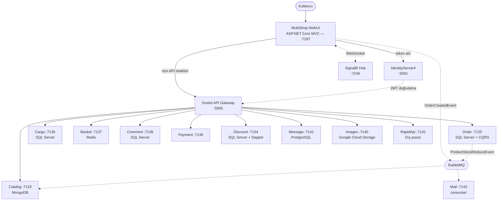
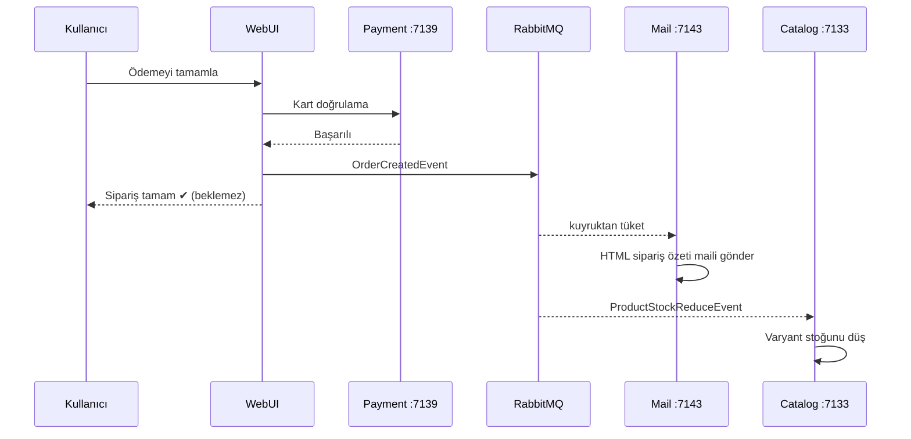

<div align="center">

# 🛒 MultiShop

**.NET 6 tabanlı, 13 mikroservisli, 4 rollü çok satıcılı (multi-vendor) e-ticaret platformu**

Ürün kataloğundan ödemeye, satıcı başvurusundan barkodlu kargo takibine kadar
uçtan uca çalışan bir pazaryeri.


</div>

---

## 📖 Proje Hakkında

MultiShop, tek bir mağazanın değil **birden fazla satıcının** ürün sattığı bir
pazaryeri uygulamasıdır. Her iş alanı (katalog, sipariş, sepet, kargo, yorum,
ödeme, mesajlaşma) kendi veritabanına sahip bağımsız bir mikroservistir; tüm
istekler **Ocelot API Gateway** üzerinden geçer ve **IdentityServer4** tarafından
üretilen JWT ile doğrulanır.

Uygulamanın ayırt edici yanı, aynı web arayüzü içinde **dört farklı rolün
birbirinden izole panellere** sahip olmasıdır: Yönetici, Satıcı, Kargo Firması ve
Müşteri. Bir kullanıcı sitede alışveriş yaparken "Satıcı Ol" başvurusunda
bulunabilir, yönetici onayladığında aynı hesapla satıcı paneline geçer.

---

## ✨ Öne Çıkan Özellikler

### 🏪 Çok satıcılı yapı
Kullanıcı satıcı başvurusu yapar, yönetici onaylar, kullanıcıya otomatik `Seller`
rolü atanır. Satıcı kendi ürünlerini, siparişlerini ve cirosunu yönetir; başka bir
satıcının ürününe erişemez.

 ### 🐳 Docker ile 6+ Veritabanı Konteynerizasyonu
Projede kullanılan tüm veri depoları (MongoDB, SQL Server veritabanları, PostgreSQL, Redis vb.) Docker
konteynerleri üzerinde izole şekilde çalışmaktadır. 6'dan fazla veritabanı Docker ortamında ayağa kaldırılarak her mikroservisin tamamen bağımsız bir veri katmanına sahip olması sağlanmıştır.

### 📦 Barkodlu kargo takip sistemi
Ödeme tamamlandığı anda `MS + yyyyMMdd + siparişNo` formatında barkod üretilir ve
kargo kaydı açılır. Kargo firması yetkilisi kendi panelinden durumu günceller
(Hazırlanıyor → Kargoya Verildi → Yolda → Dağıtımda → Teslim Edildi), her değişiklik
takip geçmişine bir hareket satırı olarak düşer. Müşteri aynı zaman çizelgesini
kendi panelinden izler.

### 🌍 Dış Pazar entegrasyonu
Ayrı bir mikroservis üzerinden gerçek e-ticaret sitelerinde ürün araması yapılır.
Hem vitrinde fiyat karşılaştırması hem de satıcı panelinde "tek tıkla ürün aktarma"
olarak kullanılır. → [Detay](#-dış-pazar-servisi-rapidapi)

### 📨 Olay tabanlı arka plan işleri
Sipariş sonrası e-posta ve stok düşürme işlemleri kullanıcıyı bekletmez; RabbitMQ
kuyruklarına düşer. → [Detay](#-olay-tabanlı-i̇letişim-rabbitmq)

### 🎨 Dinamik varyant (SKU) sistemi
Ürüne renk/beden gibi seçenekler tanımlanır, kombinasyonlar için otomatik SKU
üretilir, stok varyant bazında tutulur.

### 💬 Onay mekanizmalı yorum sistemi
Yorumlar yönetici onayından geçmeden vitrinde yıldız ortalamasına dahil edilmez.
Kullanıcı kendi yorumlarını düzenleyip silebilir.

### 🌐 6 dilli arayüz
Türkçe, İngilizce, Almanca, Fransızca, İtalyanca, Rusça — `.resx` tabanlı
lokalizasyon, çerez ile kalıcı dil seçimi.

### 🔐 Sahiplik kontrollü güvenlik
Rol kontrolü tek başına yeterli sayılmaz. Kullanıcı kimliği **URL'den değil
token'daki `sub` claim'inden** okunur; kargo, sipariş ve yorum kayıtlarında ayrıca
sahiplik doğrulaması yapılır. Yurtiçi yetkilisi Aras'a ait bir barkodu adres
çubuğuna yazsa bile göremez.

---

## 📸 Ekran Görüntüleri

### Vitrin

| Ana Sayfa | Ürün Detayı |
|---|---|
|  |  |

| Ürün Listesi | Dış Pazar Araması |
|---|---|
|  |  |

<details>
<summary><b>🛒 Alışveriş akışı</b> (sepet → adres → ödeme)</summary>


> Sepet: kupon kodu, KDV ve indirim hesabı


> Teslimat ve fatura adresi, sipariş özeti, kargo ücreti


> Ödeme ekranı — kargo firması seçimi ödeme öncesinde zorunludur


> Ürün detayında dinamik yorum ve puan ortalaması


> Satıcıya ait mağaza vitrini


</details>

<details>
<summary><b>🛠️ Yönetici Paneli</b></summary>


> 16 canlı metrik — SignalR ile anlık güncellenir


> Yorum onay / pasife alma


> Firma yetkilisi atandığında kullanıcıya otomatik `Cargo` rolü verilir


</details>

<details>
<summary><b>🏪 Satıcı Paneli</b></summary>


> Ciro, satılan adet, en çok satanlar, son siparişler


> Varyant tanımlama ve otomatik SKU üretimi


> Dış pazarda arama


> Seçilen ürünün bilgileri forma otomatik dolar
</details>

<details>
<summary><b>🚚 Kargo Firması Paneli</b></summary>


> Firma yalnızca kendi gönderilerini görür


> Durum güncelleme ve hareket geçmişi zaman çizelgesi
</details>

<details>
<summary><b>👤 Müşteri Paneli</b></summary>


</details>

---

## 🏗️ Mimari



**Akış:** WebUI hiçbir mikroservise doğrudan gitmez. `HttpClient`'lara bağlanan iki
`DelegatingHandler` token'ı otomatik ekler:

| Handler | Token türü | Ne zaman |
|---|---|---|
| `ClientCredentialTokenHandler` | Client Credentials | Ziyaretçi verisi (ürün, kategori listesi) |
| `ResourceOwnerPasswordTokenHandler` | Resource Owner Password | Kullanıcıya özel veri (sipariş, kargo, profil) |

---

## 🚪 API Gateway — Tek Kapı

13 mikroservis `localhost:7133`–`:7143` aralığında dinler. Ancak **dışarıya açık
tek adres `:5000`'dir**. WebUI hiçbir servisin gerçek portunu bilmez; kod içinde
yalnızca gateway adresi ve servis yolu tanımlıdır.

Bunun getirdikleri:

- **Port gizleme** — Mikroservislerin portları uygulamanın dışına hiç sızmaz.
  Bir servisin portu değişse WebUI'da tek satır bile değişmez, yalnızca
  `Ocelot.json` güncellenir.
- **Merkezî kimlik doğrulama** — Her mikroservise ayrı ayrı auth kurmak yerine
  gateway kapıda doğrular. Geçersiz token servise hiç ulaşmaz.
- **Scope bazlı yetkilendirme** — Her route ayrı bir `AllowedScopes` ister.
  Token'da o scope yoksa istek gateway'de `403` alır.
- **Tek adres, tek CORS, tek log noktası** — İstemci tarafında yalnızca
  `http://localhost:5000` bilinir.

### Route tablosu

```
İstemci                    Gateway                        Mikroservis
:5000/services/catalog/products  →  :7133/api/products
```

| Upstream (dışarı) | Downstream | Gerekli Scope |
|---|---|---|
| `/services/catalog/{everything}` | `:7133/api` | `CatalogReadPermission` **veya** `CatalogFullPermission` |
| `/services/discount/{everything}` | `:7134/api` | `DiscountFullPermission` |
| `/services/order/{everything}` | `:7135/api` | `OrderFullPermission` |
| `/services/cargo/{everything}` | `:7136/api` | `CargoFullPermission` |
| `/services/basket/{everything}` | `:7137/api` | `BasketFullPermission` |
| `/services/comment/{everything}` | `:7138/api` | `CommentFullPermission` |
| `/services/payment/{everything}` | `:7139/api` | `PaymentFullPermission` |
| `/services/images/{everything}` | `:7140/api` | `ImageFullPermission` |
| `/services/message/{everything}` | `:7141/api` | `MessageFullPermission` |
| `/services/rapidapi/{everything}` | `:7142/api` | `RapidApiFullPermission` |
| `/services/identity/{everything}` | `:5001` | `IdentityServerApi` |
| `/services/identity/api/Registers` | `:5001` | **— (anonim)** |

**Catalog'un iki route'u var:** ziyaretçi yalnızca `CatalogReadPermission` taşır ve
sadece okuyabilir; yönetici/satıcı token'ı `CatalogFullPermission` taşır ve yazma
işlemleri yapabilir. Aynı servis, aynı port — ayrım tamamen gateway seviyesinde.

**Tek anonim route** kayıt olma ucudur (`/api/Registers`). Henüz hesabı olmayan bir
kullanıcı token alamayacağı için bu istisna zorunludur.

Gateway'in kendi `Audience` değeri `ResourceOcelot`'tur; her mikroservis ayrıca
kendi audience'ını (`ResourceCatalog`, `ResourceOrder`...) doğrular. Yani gateway
atlansa bile servisler korumasız kalmaz.

> **İstisnalar:** Token endpoint'i (`:5001/connect/token`) ve SignalR hub'ı
> (`:7246/signalrhub`) bilinçli olarak gateway dışındadır. Birincisi token'ı
> üreten yerdir — henüz token yokken gateway'den geçemez; ikincisi kalıcı
> WebSocket bağlantısı kurar, Ocelot'un istek/yanıt modeline uymaz.

---

## 🧠 Servis Başına Farklı Mimari

Mikroservis mimarisinin en somut faydası, **her servisin kendi ihtiyacına uygun
deseni seçebilmesidir**. Bu projede bilinçli olarak farklı yaklaşımlar kullanıldı:

| Servis | Mimari / Desen | Neden bu seçildi |
|---|---|---|
| **Order** | **Onion Architecture + CQRS** (`Core` / `Infrastructure` / `Presentation`), MediatR handler'ları | En karmaşık iş kurallarının olduğu yer. Okuma (Query) ve yazma (Command) ayrımı, sipariş oluşturma akışını izlenebilir kılıyor. Domain katmanı hiçbir altyapıya bağımlı değil. |
| **Cargo** | **N-Tier katmanlı** (`Entity` / `DataAccess` / `Business` / `Dto` / `WebApi`), Generic Repository + AutoMapper | Ağırlıklı CRUD. Klasik katmanlı yapı burada CQRS'ten daha az maliyetli ve daha okunabilir. |
| **Catalog** | Tek proje, `Service + DTO + AutoMapper` | MongoDB şemasız çalışıyor; repository soyutlamasına gerek yok. Doğrudan `IMongoCollection` üzerinden hafif erişim. |
| **Discount** | Tek proje, **Dapper + ham SQL** | Sadece kupon sorguları var. EF Core'un change tracking maliyeti gereksiz; Dapper daha hızlı ve daha az kod. |
| **Basket** | Tek proje, **Redis key-value** | Sepet kalıcı veri değil. İlişkisel veritabanı yerine kullanıcı id'si anahtarlı in-memory saklama. |
| **Message** | Tek proje, EF Core + **PostgreSQL** | Farklı bir RDBMS ile mikroservis bağımsızlığını göstermek; mesajlaşma verisi diğerlerinden tamamen izole. |
| **Payment / Images / RapidApi** | Minimal servis katmanı, **stateless** | Veritabanı yok. Payment doğrulama yapar, Images GCS'e yükler, RapidApi dış API'yi çağırır. |
| **Mail** | **BackgroundService** (consumer) | HTTP ile çağrılmaz; RabbitMQ kuyruğunu dinler. |

Yani aynı çözümün içinde **MongoDB, SQL Server, PostgreSQL ve Redis** aynı anda
çalışır; **EF Core ile Dapper** yan yana durur; **CQRS ile klasik katmanlı yapı**
aynı gateway'in arkasındadır. Monolitik bir uygulamada bu seçimlerin hepsini aynı
anda yapmak mümkün değildir.

---

## 🧩 Mikroservisler

| Servis | Port | Veritabanı | Sorumluluk | Mimari not |
|---|---|---|---|---|
| **Catalog** | 7133 | MongoDB | Ürün, kategori, marka, satıcı, detay, görsel, slider | Doküman tabanlı + RabbitMQ consumer |
| **Discount** | 7134 | SQL Server | İndirim kuponları | **Dapper** |
| **Order** | 7135 | SQL Server | Sipariş, sipariş detayı, adres | **CQRS + MediatR**, Onion |
| **Cargo** | 7136 | SQL Server | Kargo firması, gönderi, barkod, takip hareketleri | 6 katmanlı, AutoMapper |
| **Basket** | 7137 | **Redis** | Sepet | Key-value |
| **Comment** | 7138 | SQL Server | Ürün yorumları, puanlama, onay | |
| **Payment** | 7139 | — | Ödeme simülasyonu, kart doğrulama | Stateless |
| **Images** | 7140 | Google Cloud Storage | Görsel yükleme | |
| **Message** | 7141 | **PostgreSQL** | Kullanıcılar arası mesajlaşma | |
| **RapidApi** | 7142 | — | Dış pazar ürün araması | TR/TL sabitlenmiş |
| **Mail** | 7143 | — | Sipariş onay e-postası | RabbitMQ consumer |
| **RabbitMQMessage** | 7104 | RabbitMQ | Kuyruk publish/read ucu | |
| **SignalRRealTime** | 7246 | — | Canlı istatistik hub'ı | WebSocket |
| **IdentityServer** | 5001 | SQL Server | Kimlik, rol, token üretimi | IdentityServer4 |
| **Ocelot Gateway** | 5000 | — | Yönlendirme, scope doğrulama | 13 route |
| **WebUI** | 7297 | — | MVC arayüzü, 4 Area | Tailwind CSS |

---

## 📨 Olay Tabanlı İletişim (RabbitMQ)

Bazı işler kullanıcının beklemesine değmez: e-posta göndermek saniyeler sürebilir,
stok düşürmek başka bir servisin ayakta olmasını gerektirir. Bu işler senkron HTTP
yerine **kuyruğa** yazılır.



### Kuyruklar

| Kuyruk | Publisher | Consumer | Sonuç |
|---|---|---|---|
| `OrderCreatedMailQueue` | `WebUI/RabbitMQ/RabbitMQPublisher` (PaymentController) | `Mail/RabbitMQ/OrderCreatedMailConsumer` | Müşteriye ürün tablosu içeren HTML sipariş onay maili gider |
| `ProductStockReduceQueue` | `Order.Application/RabbitMQ/RabbitMQPublisher` | `Catalog/RabbitMQ/ProductStockReduceConsumer` | Sipariş edilen varyantın stoğu düşülür |

### Neden kuyruk?

- **Ödeme akışı bloklanmaz.** Mail sunucusu yavaşsa veya kapalıysa kullanıcı bunu
  hiç hissetmez; sipariş onay sayfası anında açılır.
- **Mesaj kaybolmaz.** Catalog veya Mail servisi kapalıyken bile event kuyrukta
  bekler, servis ayağa kalkınca işlenir. Kuyruklar `durable: true` tanımlıdır.
- **Manuel `BasicAck`.** Mesaj ancak iş başarıyla bittikten sonra onaylanır;
  consumer işlem ortasında çökerse mesaj kuyruğa geri döner.
- **Servisler birbirini tanımaz.** Order servisi Catalog'un adresini bilmez,
  yalnızca "stok düştü" olayını yayınlar. Yarın stoku başka bir servis dinlemek
  isterse Order'da hiçbir değişiklik gerekmez.

Consumer'lar `BackgroundService` olarak çalışır — servis açıldığı anda kuyruğu
dinlemeye başlar, ayrı bir worker süreci gerekmez.

---

## ⚡ Gerçek Zamanlı Katman (SignalR)

`MultiShop.SignalRRealTimeApi` (`:7246`), sayfayı yenilemeden veri güncelleyen
WebSocket katmanıdır.

`SignalRHub` içine **12 ayrı servis** enjekte edilir (Catalog, Comment, Order,
Cargo, Discount, Message, User...). Hub, mikroservislerden topladığı sayıları tek
bir çağrıda istemciye iter:

```csharp
public async Task SendStatisticCount()
{
    // katalog, sipariş, yorum, kargo, kullanıcı sayaçlarını topla
    await Clients.All.SendAsync("ReceiveStatisticCount", ...);
}
```

**Nerede kullanılıyor:**

| Ekran | Ne yapar |
|---|---|
| `/Admin/Statistic` | 16 metrik kartı canlı güncellenir — yeni sipariş girdiğinde sayaç kendiliğinden artar |
| Admin header | Okunmamış mesaj ve bekleyen yorum rozetleri anlık güncellenir |

İstemci tarafı `wwwroot/microsoft/signalr` altındaki resmi JS istemcisiyle bağlanır:

```javascript
const connection = new signalR.HubConnectionBuilder()
    .withUrl("https://localhost:7246/signalrhub")
    .build();
```

> **Gateway dışında olmasının sebebi:** SignalR kalıcı bir WebSocket bağlantısı
> kurar; Ocelot ise istek/yanıt döngüsü üzerine kurulu bir yönlendiricidir.
> Hub'ı gateway arkasına almak bağlantının sürekli kopmasına yol açar.

---

## 🌍 Dış Pazar Servisi (RapidAPI)

`MultiShop.RapidApi` (`:7142`), **RapidAPI `real-time-product-search`** servisini
saran bağımsız bir mikroservistir. Gerçek e-ticaret sitelerinden (Trendyol,
Hepsiburada, Teknosa, A101, D&R, Boyner, BERSHKA, Pull&Bear...) canlı ürün ve
fiyat verisi çeker.

### Türkiye pazarına sabitleme

API varsayılan olarak ABD pazarını ve dolar fiyatlarını döner. Sorgu iki parametre
ile TR/TL'ye sabitlendi:

```csharp
var url =
    $"https://real-time-product-search.p.rapidapi.com/search" +
    $"?q={Uri.EscapeDataString(request.ProductName)}" +
    $"&country=tr&language=tr";
```

> API'de ayrı bir para birimi alanı yoktur; fiyat, sembolü içinde barındıran bir
> **string** olarak gelir (`"₺2.149,00"`). Satıcı panelinde forma aktarılırken bu
> metin ayrıştırılır ve **aktif kültürün ondalık ayıracına** göre dönüştürülür —
> varsayılan kültür `tr` olduğu için virgül/nokta karışması bu adımda önlenir.

### İki farklı tüketici

| Nerede | Kim kullanır | Ne yapar |
|---|---|---|
| `/ProductMarket` | Ziyaretçi | Vitrinde fiyat karşılaştırması; ürün detayında "Dış Pazara Bak" butonu |
| `/Seller/Product/SearchMarket` | Satıcı | Bulunan ürünün adı, görseli, fiyatı ve açıklaması yeni ürün formuna tek tıkla dolar |

Satıcı ucu `Unauthorized` kontrolüyle korunur — yalnızca onaylı satıcı çağırabilir.

### Neden ayrı bir mikroservis?

- **Dış bağımlılık izole edilir.** RapidAPI kota doldurursa, yavaşlarsa veya
  şemasını değiştirirse etkisi tek servisle sınırlı kalır; katalog ve sipariş
  akışı etkilenmez.
- **API anahtarı tek yerde durur.** `user-secrets` ile yalnızca bu servise
  tanımlanır; WebUI veya diğer servisler anahtarı hiç görmez.
- **Gateway arkasında normal bir servis gibi davranır.** WebUI, RapidAPI'nin var
  olduğunu bile bilmez — `:5000/services/rapidapi/...` adresine `RapidApiFullPermission`
  scope'uyla istek atar, gerisi gateway'in işidir.
- **Değiştirilebilir.** Yarın başka bir sağlayıcıya geçilse yalnızca bu servisin
  içi değişir, çağıran taraflar aynı kalır.

---

## 🛠️ Kullanılan Teknolojiler

**Backend**
`.NET 6` · `ASP.NET Core Web API` · `Entity Framework Core 6` · `Dapper` ·
`MediatR (CQRS)` · `AutoMapper` · `FluentValidation` · `Swashbuckle/Swagger`

**Kimlik & Gateway**
`IdentityServer4` · `ASP.NET Core Identity` · `JWT Bearer` · `Ocelot 23` ·
`Google OAuth`

**Veri**
`MongoDB` · `SQL Server` · `PostgreSQL (Npgsql)` · `Redis (StackExchange.Redis)`

**Mesajlaşma & Gerçek Zamanlı**
`RabbitMQ` · `SignalR`

**Frontend**
`ASP.NET Core MVC` · `Razor + ViewComponent` · `Tailwind CSS` ·
`Material Symbols` · `Vanilla JS`

**Diğer**
`Google Cloud Storage` · `RapidAPI` · `Serilog` · `.resx Localization (6 dil)`

---

## 👥 Roller ve Yetkiler

| Rol | Alan | Yetkiler |
|---|---|---|
| **Admin** | `/Admin` | Kategori, marka, slider, özel teklif, indirim, kullanıcı ve yorum yönetimi; satıcı başvurularını onaylama; kargo firması tanımlama; tüm istatistikler |
| **Seller** | `/Seller` | Kendi ürünlerini ekleme/güncelleme/silme, varyant ve görsel yönetimi, dış pazardan ürün aktarma, kendi siparişleri ve cirosu |
| **Cargo** | `/Cargo` | Yalnızca kendi firmasına ait gönderileri görüntüleme ve durum güncelleme |
| **User** | `/User` | Siparişler, kargo takibi, yorumlar, mesajlar, profil, satıcı başvurusu |

> Roller `IdentityServer/Program.cs` içinde uygulama açılışında oluşturulur.
> Rol ataması yapılan kullanıcının **çıkış yapıp tekrar giriş yapması** gerekir —
> rol claim'i oturum çerezinde taşınır.

---

<div align="center">

**[⬆ Başa dön](#-multishop)**

</div>
